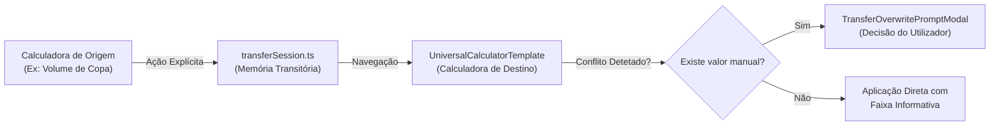
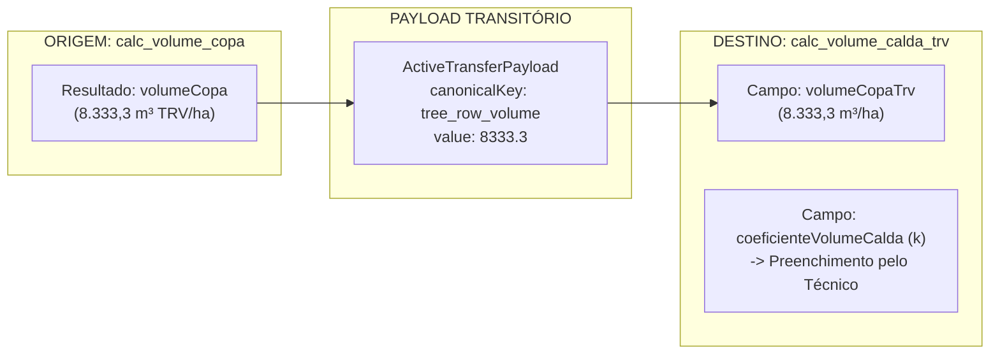

# Especificação Técnica: Transferência de Dados entre Calculadoras
**DATERRA Smart** | Arquitetura de Interoperabilidade e Proteção de Dados de Sessão

- **Data de Criação:** 06 de Setembro de 2026  
- **Estado do Documento:** `Especificação Arquitetural e Estado de Implementação`  
- **Versão:** 1.0.0  
- **Âmbito:** Mapeamento do serviço canónico de transferências, proteção contra sobrescrita e matriz de elegibilidade operacional.

---

## 1. Objetivo e Princípios Arquiteturais

A funcionalidade de transferência entre calculadoras (*"Usar noutra ferramenta"*) permite encadear fluxos de calibração agrícola sem exigir a reintrodução manual de grandezas já calculadas.



### Princípios Inegociáveis de Segurança:
1. **Transferência Exclusivamente Explícita:** Nunca ocorre transferência automática sem que o utilizador clique num botão de ação deliberado.
2. **Prevenção Total de Sobrescrita Silenciosa:** Se a ferramenta de destino já contiver dados manuais introduzidos na sessão, o sistema bloqueia a substituição automática e exige confirmação.
3. **Isolamento Transacional em Memória:** Os dados transferidos residem exclusivamente em memória transitória (`transferSession.ts`), sem parâmetros de URL e sem escrita na base de dados antes da confirmação.
4. **Preservação Estrita do Histórico:** Os registos históricos em `calculation_history_v2` permanecem completamente estanques e isolados por `calculatorId`.
5. **Diferenciação Visual:** O valor transferido é assinalado com uma faixa informativa de proveniência, mantendo-se $100\%$ editável pelo operador.
6. **Funcionamento $100\%$ Offline:** Todo o mecanismo opera localmente no dispositivo, sem chamadas de rede ou dependências externas.

---

## 2. Componentes e Ficheiros Reais da Arquitetura

A arquitetura de transferências é composta pelos seguintes módulos declarativos:

| Ficheiro / Componente | Localização | Responsabilidade Técnica |
|---|---|---|
| `transferTypes.ts` | `src/features/calculators/core/` | Definição das interfaces TypeScript: `ActiveTransferPayload`, `ToolTransferPreview`, `FieldTransferCandidate`. |
| `transferSession.ts` | `src/features/calculators/core/` | Gestor singleton em memória e hook reativo `usePendingTransfer()` para comunicação entre componentes. |
| `transferService.ts` | `src/features/calculators/core/` | Motor de avaliação de compatibilidade dimensional e regras estritas de elegibilidade. |
| `CalculationTransferModal.tsx` | `src/features/calculators/history/` | Modal que lista as ferramentas de destino elegíveis a partir do cartão de histórico. |
| `TransferOverwritePromptModal.tsx`| `src/features/calculators/history/` | Modal de arbitragem em caso de conflito entre valores manuais e valores recebidos. |
| `UniversalCalculatorTemplate.tsx`| `src/features/calculators/core/` | Componente central que consome a transferência pendente, valida conflitos e injeta os valores no formulário. |

---

## 3. Transferência Atualmente Implementada e Validada

Atualmente, existe exatamente **uma transferência canónica implementada e homologada**:



### Detalhe do Mapeamento Homologado:
- **Ferramenta de Origem:** `calc_volume_copa` (Calculadora de Volume de Copa).
- **Valor de Origem:** Resultado consolidado `volumeCopa` (dimensão `volume`, unidade `m³ TRV/ha`, chave canónica `tree_row_volume`).
- **Ferramenta de Destino:** `calc_volume_calda_trv` (Calculadora de Volume de Calda por TRV).
- **Campo de Destino Preenchido:** `volumeCopaTrv` (dimensão `volume`, unidade `m³/ha`).
- **O que NÃO É Transferido (Restrições Estritas):**
  - O coeficiente de volume de calda ($k$ em $\text{L/m}^3$) **não é transferido**; permanece como campo a preencher pelo técnico.
  - Perfil cultural e patamares de densidade não são transferidos.
  - Parâmetros elementares de copa (altura, largura e entrelinha) são omitidos, pois o destino consome exclusivamente o TRV consolidado.

### Comportamento no Destino:
1. **Faixa de Origem:** A ferramenta de destino apresenta a mensagem destacada:  
   `"TRV importado da Calculadora de Volume de Copa."`
2. **Edição do Valor:** O valor importado pode ser alterado livremente pelo utilizador sem quebrar a integridade do cálculo.
3. **Gestão de Conflito:** Se o operador já tiver introduzido manualmente um valor de TRV antes da transferência, o modal `TransferOverwritePromptModal` é acionado, permitindo escolher entre *"Manter Valor Atual"* ou *"Substituir pelo Valor Recebido"*.

---

## 4. Transferências Futuras Candidatas (NÃO IMPLEMENTADAS)

As seguintes transferências foram identificadas como oportunidades operacionais para a Fase 2, mas **não se encontram ativas nem implementadas no código atual**:

| Transferência Candidata | Origem | Destino | Variável a Transferir | Estado Atual |
|---|---|---|---|---|
| **TRV para Débito Total** | `calc_volume_calda_trv` | `calc_debito_total` | Volume de calda final ($Q$ em $\text{L/ha}$) $\to$ `volumeCalda` | `Candidata Fase 2` (Inativa) |
| **Velocidade para Débito** | `calc_velocidade_real` | `calc_debito_total` | Velocidade real ($v$ em $\text{km/h}$) $\to$ `velocidadeTrabalho` | `Candidata Fase 2` (Inativa) |
| **LWA para Suite EPPO** | `calc_area_parede_foliar` | Futura ferramenta de dose LWA | Área de parede foliar ($\text{m}^2\text{ LWA/ha}$) | `Candidata Fase 2` (Inativa) |
| **Dose para Concentração** | `calc_dose` | `calc_concentracao` | — | **Desativada** (Sem equivalência física direta) |

### Requisitos Obrigatórios para Habilitação de Futuras Transferências:
1. Elaboração de especificação técnica e agronómica isolada.
2. Comprovação da equivalência dimensional estrita entre grandezas físicas.
3. Implementação das regras no `transferService.ts` com validação de `unfilledTargetFields` e `incompatibleSourceValues`.
4. Testes de regressão cobrindo cenários de conflito e recarregamento offline.

---

## 5. Matriz de Casos de Teste de Transferência

Todos os fluxos de transferência são validados através dos seguintes cenários de teste:

```text
┌────┬─────────────────────────────────┬────────────────────────────────────────────────────────────────┐
│ #  │ Cenário de Teste                │ Comportamento Esperado                                         │
├────┼─────────────────────────────────┼────────────────────────────────────────────────────────────────┤
│ 1  │ Destino Vazio                   │ Aplicação imediata do valor com faixa informativa de origem.   │
│ 2  │ Destino com Valor Manual Prévio │ Abre TransferOverwritePromptModal com comparação lado a lado. │
│ 3  │ Escolha "Substituir"            │ Substitui o valor no formulário e limpa a transferência pendente│
│ 4  │ Escolha "Manter Atual"          │ Mantém o valor manual e descarta o payload da transferência.   │
│ 5  │ Ação "Cancelar"                 │ Limpa o payload pendente sem qualquer alteração no formulário. │
│ 6  │ Edição do Valor Importado       │ O valor pode ser editado; a faixa informativa permanece ativa.│
│ 7  │ Navegação de Retorno            │ Voltar à origem não repete a transferência já consumida.       │
│ 8  │ Funcionamento em Modo Offline   │ Transferência 100% operacional sem rede e sem erros na consola │
└────┴─────────────────────────────────┴────────────────────────────────────────────────────────────────┘
```

---

## 6. Limitações Conhecidas e Decisões de Arquitetura

1. **Ciclo de Vida Efémero:** A transferência pendente é apagada se o utilizador fechar o separador do browser ou navegar para uma ferramenta não relacionada antes de chegar ao destino.
2. **Isolamento de Estado:** A gravação de um cálculo na calculadora de destino gera um registo autónomo no histórico, contendo um snapshot independente das variáveis.
3. **Incompatibilidade Estrita Dose $\leftrightarrow$ Concentração:** Mantém-se o bloqueio canónico total de transferência direta entre Dose por Hectare e Concentração da Calda, devido à ausência de relação matemática direta sem parametrização da cultura e do pulverizador.
