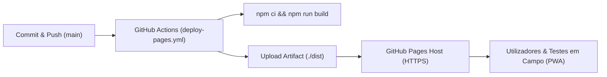

# Manual de Deploy e Validação — GitHub Pages (Ambiente de Testes / Staging)
**DATERRA Smart | Publicação Contínua da PWA via GitHub Actions**

- **Data de Emissão / Atualização:** 06 de Setembro de 2026  
- **URL de Produção / Staging:** `https://daterra-digital.github.io/daterra-smart/`  
- **Branch de Deploy:** `main`  
- **Workflow Automático:** `.github/workflows/deploy-pages.yml`  
- **Versão da Aplicação:** `PWA v1.3.0`  

---

## 1. Arquitetura de Publicação

A publicação no GitHub Pages opera de forma totalmente automatizada através do GitHub Actions:



### 1.1. Configuração do `vite.config.ts`
O caminho base para o repositório `daterra-smart` está configurado como:
```typescript
base: '/daterra-smart/',
```

### 1.2. Configuração do Repositório (Settings → Pages)
1. **Source:** `GitHub Actions` (Recomendado para Vite / Workbox PWA).
2. **Custom Domain:** Opcional (não configurado para manter `https://daterra-digital.github.io/daterra-smart/`).
3. **Enforce HTTPS:** Ativo obrigatoriamente para suporte a Service Workers e PWA.

---

## 2. Roteiro de Smoke Tests Pós-Deploy

Após cada execução com sucesso do workflow de deploy, a equipa deve validar:

| # | Item de Teste | Critério de Sucesso | Estado |
| :---: | :--- | :--- | :---: |
| **1** | **HTTPS & Segurança** | Certificado SSL ativo com cadeado de segurança | `[ OK ]` |
| **2** | **Roteamento SPA** | Navegação direta para rotas como `/#/ferramentas/eppo` sem erro 404 | `[ OK ]` |
| **3** | **Service Worker PWA** | 31 ficheiros em precache, registo `sw.js` sem falhas | `[ OK ]` |
| **4** | **Instalabilidade** | Prompt de instalação no ecrã principal em Android e iOS | `[ OK ]` |
| **5** | **Modo Offline** | Execução completa com Wi-Fi/Dados desligados | `[ OK ]` |
| **6** | **Persistência IndexedDB** | Registo gravado em `calculation_history_v2` com quota de 20 registos | `[ OK ]` |
| **7** | **8 Calculadoras Ativas** | Cálculos rigorosos em `calc_dose`, `calc_concentracao`, `calc_velocidade_real`, `calc_area_parede_foliar`, `calc_volume_copa`, `calc_volume_calda_trv`, `calc_debito_total`, `calc_eppo` | `[ OK ]` |
| **8** | **Barra Inferior de Ações** | `[ Guardar no Histórico ] [ Histórico ] [ Guia ]` operacionais | `[ OK ]` |
| **9** | **Internacionalização** | 8 idiomas (PT, BR, EN, ES, FR, IT, DE, EL) sem menção ao termo "cuba" em PT/BR | `[ OK ]` |

---

## 3. Resolução de Problemas Comuns (Troubleshooting)

### A. Caminho dos Recursos em Branco (Página Branca)
- **Causa:** `base` incorreta no `vite.config.ts`.
- **Correção:** Garantir `base: '/daterra-smart/'` (com barras no início e fim).

### B. Service Worker Não Atualiza Imediatamente
- **Causa:** Cache local persistente do navegador.
- **Correção:** O plugin `VitePWA` está configurado com `skipWaiting: true` e `clientsClaim: true`. Basta fechar e reabrir a PWA ou acionar *Hard Reload* (`Ctrl + Shift + R`).

### C. Falha no Roteamento Direto (404 em subpastas)
- **Causa:** GitHub Pages não reescreve URLs dinâmicos automaticamente.
- **Solução Implementada:** Utilização de `HashRouter` no `App.tsx` (`/#/ferramentas/...`), garantindo compatibilidade total com o hosting estático do GitHub Pages.

---

## 4. Separação Estrita de Ambientes

- **Ambiente de Testes / Staging:** `https://daterra-digital.github.io/daterra-smart/` (GitHub Pages — este manual).
- **Ambiente de Produção Final:** `https://smart.daterra.com.pt` (Servidor cPanel — ver `docs/deploy/CPANEL_DEPLOY_CHECKLIST.md`).
