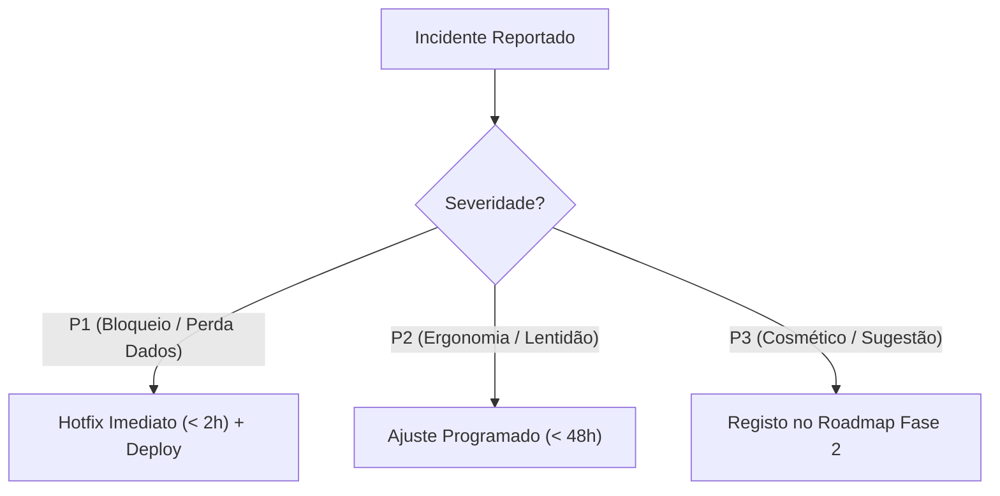

# Protocolo de Monitorização Pós-Deploy (1.ª Semana)
**DATERRA Smart | Acompanhamento Operacional, Telemetria e Estabilidade**

- **Data de Início:** 06 de Setembro de 2026  
- **Período de Acompanhamento:** 7 dias pós-deploy  
- **Responsável:** Equipa de Qualidade, UX e Suporte Técnico  

---

## 1. Objetivos da Monitorização

A fase pós-deploy assegura que a transição para produção decorre sem regressões funcionais, perda de dados ou anomalias em dispositivos de campo. Acompanha os seguintes pilares:

1. **Estabilidade do Service Worker & Offline Cache:** Verificar se as atualizações de versão são aplicadas sem bloquear utilizadores offline.
2. **Integridade da Base de Dados Local (`IndexedDB`):** Confirmar que o histórico de cálculos (`calculation_history_v2`) se mantém persistente e que a quota de 20 cálculos por ferramenta opera corretamente.
3. **Desempenho e Telemetria de Erros:** Monitorizar falhas de execução de JavaScript ou incompatibilidades com versões antigas do Safari/iOS ou Android Webview.
4. **Recolha de Feedback Contínuo:** Receber e triar comentários de operadores, agricultores e técnicos.

---

## 2. Roteiro Diário de Monitorização (7 Dias)

| Dia | Ação de Controlo | Responsável | Métrica / Critério de Sucesso |
| :---: | :--- | :--- | :--- |
| **D+1** | **Verificação de Acessos Iniciais & SSL** | DevOps | $100\%$ de requisições HTTPS sem alertas de certificado |
| **D+2** | **Auditoria de Registo de Service Workers** | Front-end | Taxa de ativação do Service Worker $> 98\%$ |
| **D+3** | **Verificação de Quotas IndexedDB** | QA / Dados | Sem erros `QuotaExceededError` reportados |
| **D+4** | **Inspeção de Logs e Consola do Navegador** | QA | $0$ erros críticos não capturados nos fluxos de cálculo |
| **D+5** | **Auditoria de Fórmulas e Normalização de Unidades** | Agrónomo | $100\%$ de concordância dos resultados em auditorias de campo |
| **D+6** | **Teste de Atualização Silenciosa PWA** | Front-end | Cache antiga limpa com sucesso (`cleanupOutdatedCaches`) |
| **D+7** | **Relatório de Consolidação Semanal** | UX Lead | Síntese de incidentes e passagem a operação de rotina |

---

## 3. Matriz de Triagem de Incidentes Pós-Deploy

Caso surja qualquer anomalia reportada por utilizadores, a triagem segue o protocolo:

---

## 4. Checklist de Validação Final da 1.ª Semana

- [ ] Zero relatos de perda de cálculos no histórico local;
- [ ] Funcionamento comprovado em pelo menos 15 modelos diferentes de smartphones;
- [ ] Confirmação de que todas as 8 calculadoras operam a $100\%$ sem ligação à internet;
- [ ] Nenhuma menção ao termo ambíguo "cuba" em território português;
- [ ] Aprovação formal para encerramento do período de hipervigilância.
