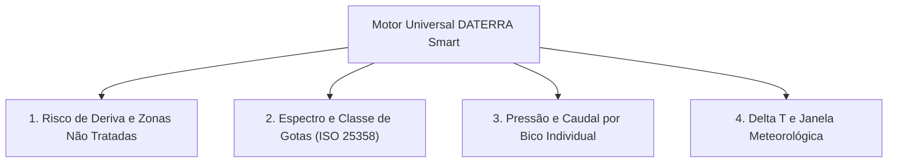

# Plano de Expansão e Roadmap Funcional — Fase 2
**DATERRA Smart | Evolução Tecnológica, Novas Calculadoras e Recursos Avançados**

- **Data de Emissão:** 06 de Setembro de 2026  
- **Estado:** `Planeamento Estratégico Pós-Deploy de Produção`  
- **Versão:** 2.0.0-PROPOSAL  
- **Enquadramento:** Expansão de funcionalidades após consolidação do ecossistema universal de calculadoras (Fase 1).

---

## 1. Visão Geral da Fase 2

Com o encerramento com sucesso do primeiro ciclo de auditoria e implementação UX, a **DATERRA Smart** dispõe de um motor declarativo maduro (`UniversalCalculatorTemplate`), teclado unificado (`DaterraUnifiedKeypadModal`), barra contextual inferior (`CalculatorActionBar`), persistência local robusta (`IndexedDB` com `calculation_history_v2`) e suporte multi-idioma (8 línguas).

A **Fase 2 (Expansão)** capitaliza sobre esta infraestrutura para introduzir **4 novas calculadoras agronómicas de precisão**, **funcionalidades avançadas de dados e relatórios** e **melhorias ergonómicas de próxima geração**.

---

## 2. Novas Calculadoras Agronómicas de Precisão

### 2.1. Calculadora de Risco de Deriva e Zonas de Segurança (*Buffer Zones*)
- **Objetivo:** Determinar a distância de segurança obrigatória a linhas de água e zonas habitadas com base na tecnologia de redução de deriva do pulverizador ($50\%$, $75\%$, $90\%$ ou $95\%$ segundo normas DGAV).
- **Fórmulas:** Ajuste de zonas tampão em função do tipo de bico anti-deriva (injeção de ar) e defletores de ar.
- **Integração:** Interligação com a Calculadora EPPO e Perfil de Bicos.

### 2.2. Calculadora de Tamanho e Espectro de Gotas (Norma ISO 25358)
- **Objetivo:** Estimar o Diâmetro Volumétrico Mediano ($\text{VMD / } D_{v0.5}$) e a percentagem de gotas suscetíveis a deriva ($< 105\ \mu\text{m}$) com base na pressão e no modelo de bico selecionado.
- **Classes de Gotas:** Muito Fina (VF), Fina (F), Média (M), Grossa (C), Muito Grossa (VC), Extremamente Grossa (XC), Ultra Grossa (UC).
- **Utilidade:** Assegurar a penetração foliar em alvos densos minimizando perdas por evaporação.

### 2.3. Calculadora de Pressão de Trabalho e Caudal por Bico
- **Objetivo:** Determinar a pressão exata no manómetro para atingir o débito desejado em função da velocidade de trabalho e do calibre do bico:
  $$p = p_{\text{ref}} \times \left( \frac{q}{q_{\text{ref}}} \right)^2$$
- **Avisos:** Deteção de desvios da faixa ideal de pressão (evitar pressões demasiado altas que originam névoa fina).

### 2.4. Calculadora de Delta T ($\Delta T$) e Janela de Oportunidade Meteorológica
- **Objetivo:** Calcular o diferencial psicrométrico entre termómetro seco e termómetro húmido ($\Delta T$) a partir da temperatura do ar e da humidade relativa:
  - $\Delta T < 2^\circ\text{C}$ (Risco de baixa absorção / orvalho excessivo);
  - $\Delta T \in [2^\circ\text{C}, 8^\circ\text{C}]$ (**Janela Ideal de Pulverização**);
  - $\Delta T > 8^\circ\text{C}$ (Risco severo de evaporação das gotas antes do alvo).

---

## 3. Funcionalidades Avançadas de Produtividade

### 3.1. Mapeamento de Parcelas e Georreferenciação por GPS
- **Delimitação de Polígonos:** Desenho de talhões no mapa com cálculo automático da área real em hectares;
- **Posicionamento em Campo:** Utilização do GPS do smartphone para sugerir automaticamente a parcela em que o operador se encontra;
- **Compatibilidade Offline:** Cache de mosaicos cartográficos locais no dispositivo.

### 3.2. Exportação de Relatórios Oficiais em PDF (Caderno de Campo Digital DGAV)
- **Geração Client-Side:** Criação instantânea de folhas de tratamento em PDF via `jsPDF` / `pdfmake` sem necessidade de ligação à internet;
- **Campos Obrigatórios:** Data, parcela, produto comercial, número de APV, dose autorizada, volume de calda, operador e equipamento de aplicação;
- **Conformidade Legal:** Formato harmonizado com as exigências dos organismos de controlo e certificação (GlobalGAP, Biológico, Produção Integrada).

### 3.3. Integração com Estações Meteorológicas e Sensores Locais
- **Conectividade IoT:** Suporte a dados em tempo real de mini-estações meteorológicas de campo via Bluetooth Low Energy (BLE) ou APIs de previsão agrícola;
- **Alertas Proativos:** Notificação de inversão térmica, rajadas de vento acima de $3\text{ m/s}$ ($10,8\text{ km/h}$) ou humidade desfavorável.

### 3.4. Sincronização em Nuvem Opcional
- **Armazenamento Híbrido:** Manter o funcionamento primário em `IndexedDB` local com backup e sincronização segura em conta de utilizador quando existir conectividade;
- **Multi-Dispositivo:** Possibilidade de consultar no escritório do computador os registos de aplicação efetuados pelo tratorista no telemóvel.

---

## 4. Melhorias Contínuas de Experiência de Utilizador (UX)

### 4.1. Modo Escuro (*Dark Mode*) Otimizado para Campo
- **Benefício:** Redução do encandeamento e cansaço visual em tratamentos fitossanitários realizados ao amanhecer, entardecer ou período noturno;
- **Economia de Bateria:** Menor consumo energético em ecrãs OLED durante longas jornadas de trabalho agrícola.

### 4.2. Gestão de Favoritos e Atalhos Rápidos
- **Personalização do Dashboard:** Possibilidade de fixar as 2 ou 3 calculadoras mais utilizadas no topo do ecrã inicial;
- **Parâmetros Pré-Preenchidos:** Gravação de perfis de pulverizador padrão para arranque instantâneo do cálculo.

### 4.3. Tutoriais e Guias Interativos Passo-a-Passo
- **Walkthrough Guiado:** Passo-a-passo visual no primeiro acesso para utilizadores de baixa literacia digital;
- **Capacitação Agronómica:** Integração mais profunda de hiperligações para módulos formativos da **Academia DATERRA**.

---

## 5. Cronograma e Priorização da Fase 2

| Bloco | Entregáveis | Prioridade | Esforço Estimado |
| :--- | :--- | :---: | :---: |
| **Fase 2A** | Calculadoras de Delta T ($\Delta T$) e Pressão/Caudal | `Alta` | 2 semanas |
| **Fase 2B** | Exportação de Caderno de Campo em PDF e Dark Mode | `Alta` | 2 semanas |
| **Fase 2C** | Calculadoras de Deriva e Classe de Gotas (ISO 25358) | `Média` | 3 semanas |
| **Fase 2D** | Georreferenciação GPS e Sincronização em Nuvem | `Média` | 4 semanas |
