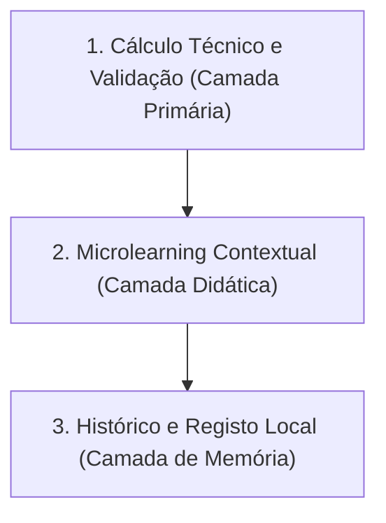

# Manual de Referência: Padrão Unificado de Calculadoras (Universal Calculator Pattern)
**DATERRA Smart** | Framework Universal de Calibração e Pulverização Agrícola

- **Data de Criação:** 06 de Setembro de 2026  
- **Estado do Documento:** `Implementado e Validado nas Fases 1A e 1B / Referência Oficial`  
- **Versão:** 1.0.0  
- **Âmbito:** Guia arquitetural e de design para implementação de ferramentas de cálculo no ecossistema DATERRA Smart.

---

## 1. Objetivo e Âmbito

Este documento estabelece o padrão oficial de experiência de utilização (UX), arquitetura de componentes, fluxo de dados e acessibilidade para todas as calculadoras da plataforma DATERRA Smart.

O objetivo é assegurar:
1. **Consistência Ergonómica Estrita:** O utilizador encontra o mesmo modelo mental e os mesmos controlos em qualquer ferramenta.
2. **Robustez no Terreno:** Funcionamento fiável ao ar livre, sob luz solar intensa, operável com uma mão e com luvas agrícolas.
3. **Prevenção de Duplicação:** Reutilização dos motores atómicos declarativos sem código duplicado ou layouts divergentes.

---

## 2. Princípios de Produto

As ferramentas de cálculo da DATERRA Smart regem-se pela seguinte hierarquia de valor:



1. **Cálculo Técnico em Primeiro Lugar:** A resposta quantitativa clara e a unidade de medida são a prioridade absoluta no ecrã.
2. **Microlearning Contextual em Segundo Plano:** O conteúdo pedagógico e normativo está sempre disponível via `DidacticHelp`, mas nunca obstrui o fluxo operacional de introdução de dados.
3. **Histórico e Registo como Terceira Camada:** Persistência em `IndexedDB` (`calculation_history_v2`) para auditoria técnica e consulta, com quota estrita de 20 registos.
4. **Offline-First Absoluto:** Todo o motor matemático, teclado, validação e microlearning operam a $100\%$ sem ligação à internet.
5. **Mobile-First & Desktop com Identidade Própria:** A interface mobile é otimizada para o polegar e ecrãs compactos ($320\text{ px}$ a $1023\text{ px}$). A interface desktop ($\ge 1024\text{ px}$) tira partido do espaço com layout em grelha dividida (*split view*) e suporte integral a teclado físico.

---

## 3. Padrão Mobile (< 1024 px)

Em ecrãs móveis e tablets compactos, o layout é gerido centralmente pelo `UniversalCalculatorTemplate.tsx`:

```text
┌────────────────────────────────────────────────────────┐
│  STICKY RESULT HEADER (Fixo no topo da viewport)       │
│  [Ícone] DÉBITO TOTAL: 24,0 L/min                      │
│          Submétrica: 1,20 L/min por bico               │
│          [Botão: Introduzir / Editar Dados]            │
├────────────────────────────────────────────────────────┤
│  ÁREA DE CONTEÚDO PRINCIPAL (Scroll vertical suave)    │
│                                                        │
│  [Blocos Especializados de Assistência (se existirem)] │
│   Ex: Seletor de Densidade TRV / Critério de Largura   │
│                                                        │
│  RESUMO DE VALORES CONFIRMADOS                         │
│  ┌──────────────────────────────────────────────────┐  │
│  │ Volume de Calda             600 L/ha        [✎]  │  │
│  ├──────────────────────────────────────────────────┤  │
│  │ Velocidade Real             6,0 km/h        [✎]  │  │
│  ├──────────────────────────────────────────────────┤  │
│  │ Largura de Trabalho         4,0 m           [✎]  │  │
│  └──────────────────────────────────────────────────┘  │
│                                                        │
│  [Ação Secundária: Divulgação Progressiva de Bicos]    │
│  [Notas Informativas Não Bloqueantes]                  │
│                                                        │
│  [Botão: Guardar Cálculo no Histórico (IndexedDB)]     │
│  [DidacticHelp: Microlearning da Ferramenta]           │
└────────────────────────────────────────────────────────┘
```

### Regras do Padrão Mobile:
- **Sticky Result Header:** Fixado no topo, apresenta sempre o resultado principal com tipografia destacada e a submétrica correspondente. Contém botão de acesso direto ao teclado unificado.
- **Resumo de Valores Confirmados:** Cada linha exibe o rótulo do campo, o valor ativo com a respetiva unidade e um botão táctil de edição individual.
- **Sem Inputs Tradicionais Fora do Keypad:** Em mobile, os campos numéricos não abrem o teclado virtual do sistema operativo (que desconfigura o viewport); a introdução é feita exclusivamente através do `DaterraUnifiedKeypadModal`.
- **Ação "Editar Tudo":** Permite percorrer todos os campos sequencialmente dentro do modal.
- **Microlearning Recolhido por Defeito:** Acessível através do botão de ajuda com alvo tátil $\ge 48\text{ px}$.

---

## 4. Padrão Desktop ( $\ge 1024\text{ px}$ )

Em ecrãs de computador e computadores de bordo de grandes dimensões:

```text
┌──────────────────────────────────────┬──────────────────────────────────────┐
│ COLUNA ESQUERDA (5 / 12)             │ COLUNA DIREITA (7 / 12)              │
│ Entradas e Configurações             │ Resultados, Análise e Histórico      │
│                                      │                                      │
│ [Cabeçalho com Microlearning Geral]  │ PAINEL DE RESULTADO PRINCIPAL        │
│                                      │ DÉBITO TOTAL: 24,0 L/min             │
│ [Seletores Especializados (se aplic)]│                                      │
│                                      │ SUBMÉTRICAS E EQUIVALÊNCIAS          │
│ FORMULÁRIO DE ENTRADAS DIRETAS       │ Débito médio: 1,20 L/min por bico    │
│ - Suporte a Tabulação (Tab / Shift)  │                                      │
│ - Digitação com teclado físico       │ AVISOS DE PLAUSIBILIDADE AGRONÓMICA  │
│ - Atalhos rápidos (presets em pílula)│ Nota neutra de distribuição vertical │
│                                      │                                      │
│ [Botão Opcional: Teclado Unificado]  │ [Botão: Guardar no Histórico]        │
│                                      │ [Ação: Transferir para outra ferram.]│
└──────────────────────────────────────┴──────────────────────────────────────┘
```

### Regras do Padrão Desktop:
- **Inputs Diretos com Foco Físico:** Campos de entrada tradicionais com `<input readOnly={false}>` em desktop, permitindo digitação direta e navegação fluida por `Tab`.
- **Painel Lateral Fixo:** O resultado é recalculado e exibido instantaneamente no painel lateral direito.
- **Keypad como Opção Complementar:** O botão para abrir o `DaterraUnifiedKeypadModal` permanece disponível para utilizadores em monitores tácteis de cabina.

---

## 5. Protocolo do `DaterraUnifiedKeypadModal`

O `DaterraUnifiedKeypadModal` é o componente central de introdução de dados da aplicação.

### 5.1 Arquitetura de Isolamento em Memória
- **Cópia Profunda Transitória:** Ao abrir, o modal cria uma cópia profunda (*deep copy*) de todos os campos e do modo ativo.
- **Cancelamento Seguro:** Clicar no botão `X`, no fundo do ecrã ou premir `Escape` descarta todas as edições em curso sem alterar o formulário base.
- **Confirmação Explícita:** Apenas ao clicar em *"Concluir"* os valores validados são propagados para o estado da calculadora.

### 5.2 Parser de Expressões Aritméticas Seguro
- Implementado em `src/features/calculators/core/expressionParser.ts`.
- **Zero `eval()`:** A avaliação é realizada por um analisador léxico seguro que suporta as 4 operações básicas ($+$, $-$, $\times$, $\div$).
- **Localização:** Aceita vírgula (`,`) em contextos `pt-PT` / `pt-BR` / `es-ES` e ponto (`.`) em inglês, tratando a normalização antes do cálculo.

### 5.3 Gestão de Unidades e Reset Seguro
- **Unidades Fixas:** O campo opera na unidade predefinida.
- **Unidades com Conversão Direta:** (Ex: $\text{L/ha} \leftrightarrow \text{mL/ha}$). O valor numérico é convertido proporcionalmente pelo fator dimensional.
- **Unidades Não Conversíveis / Mudança de Família:** (Ex: produto líquido em $\text{L/ha}$ para produto sólido em $\text{kg/ha}$). O modal emite um aviso informativo e solicita a reintrodução segura do valor numérico, prevenindo erros operacionais graves no campo.

---

## 6. Acessibilidade e Ergonomia Táctil (WCAG 2.1 AA)

| Requisito | Implementação Técnica no Ecossistema |
|---|---|
| **Dimensão dos Alvos Táteis** | Todos os botões, teclas numéricas e cartões de opção têm dimensão mínima de **$48 \times 48\text{ px}$** (`min-h-[48px]`). |
| **Cartões de Seleção** | Cartões de densidade e critérios de largura com altura $\ge 56\text{ px}$ em mobile. |
| **Navegação por Teclado** | Sequência lógica de `Tab` / `Shift+Tab` com anel de foco bem visível (`focus-visible:outline-2`). |
| **Focus Trap no Modal** | Retenção do foco dentro do `DaterraUnifiedKeypadModal` enquanto estiver aberto. |
| **Restauração de Foco** | Ao fechar o modal ou DidacticHelp, o foco regressa exatamente ao elemento que abriu a janela. |
| **Semântica ARIA** | Seletores e botões de estado utilizam `aria-pressed="true/false"` e `aria-label` descritivos. |
| **Movimento Reduzido** | Suporte a `prefers-reduced-motion: reduce` com a classe `motion-reduce:transition-none`. |
| **Segurança de Ecrã (Safe Area)** | Respeito por `env(safe-area-inset-bottom)` para evitar sobreposição com a barra de navegação. |
| **Viewport Estreito ($320\text{ px}$)** | Zero scroll horizontal (`overflow-x: hidden`), layouts em grelha fluida adaptável. |

---

## 7. Hierarquia Visual da Informação

Ao desenhar ou manter uma calculadora, a informação deve respeitar a ordem estrita:

1. **Resultado Primário:** O valor final em destaque máximo com unidade clara (ex: `24,0 L/min`).
2. **Submétrica Contextual:** Indicador auxiliar que apoia a decisão (ex: `1,20 L/min por bico` ou `TRV: 8.333,3 m³/ha`).
3. **Erros de Validação Bloqueantes (`errors`):** Texto a vermelho suave com ícone de alerta, bloqueando o cálculo e a gravação.
4. **Avisos de Plausibilidade Não Bloqueantes (`warnings`):** Texto a âmbar com ícone de aviso para valores fora do intervalo agronómico típico, permitindo ao operador prosseguir se for uma situação real específica.
5. **Campos de Entrada:** Agrupados e rotulados com linguagem clara e unidades visíveis.
6. **Microlearning Didático:** Acesso contextual através do botão "Ajuda".

---

## 8. Checklist Obrigatório para Criação de Novas Calculadoras

Antes de submeter qualquer nova ferramenta de cálculo para homologação, verificar todos os pontos:

- [ ] **1. Configuração Declarativa:** Ficheiro `*CalculatorConfig.ts` com ID técnico canónico, título, subtítulo e categoria oficial.
- [ ] **2. Função Matemática Pura:** Ficheiro `calculate*Pure.ts` isolado, sem dependências de React ou DOM, com testes unitários cobrindo limites, decimais e divisão por zero.
- [ ] **3. Validação e Limites:** Método `validate` com separação estrita entre `errors` (bloqueantes) e `warnings` (não bloqueantes).
- [ ] **4. Atalhos (Presets):** Exatamente 4 presets por campo, representativos da prática agronómica real.
- [ ] **5. Precisão Numérica:** Casas decimais estritamente definidas e documentadas no resultado primário e auxiliar.
- [ ] **6. Integração Universal:** Declaração dos campos no `UniversalCalculatorTemplate` com suporte a Sticky Header e teclado unificado.
- [ ] **7. Persistência Offline:** Histórico associado exclusivamente à tabela `calculation_history_v2` com limite de 20 cálculos e soft-delete.
- [ ] **8. Internacionalização (i18n):** Chaves declaradas e sincronizadas nos 8 ficheiros de tradução (`pt`, `br`, `en`, `es`, `fr`, `it`, `de`, `el`). Ausência de termos proibidos (como "cuba" em PT/BR).
- [ ] **9. Microlearning:** 5 ficheiros Markdown normativos com 10 secções estruturadas, importados via `?raw`.
- [ ] **10. Testes Automatizados:** Suite em `test/phase*.test.mjs` com 100% de aprovação em `node --test`.

---

## 9. Inventário de Componentes Reutilizáveis Oficiais

```text
src/
├── components/
│   ├── DaterraUnifiedKeypadModal.tsx      # Modal de teclado numérico unificado
│   └── BottomNavigationBar.tsx             # Navegação principal PWA
├── features/
│   ├── calculators/
│   │   ├── core/
│   │   │   ├── UniversalCalculatorTemplate.tsx # Template mestre responsivo
│   │   │   ├── expressionParser.ts             # Parser matemático seguro
│   │   │   ├── transferService.ts              # Serviço canónico de transferências
│   │   │   └── transferSession.ts              # Gestor de sessão em memória
│   │   └── history/
│   │       ├── CalculationHistoryCard.tsx      # Cartão de cálculo com snapshot
│   │       └── TransferOverwritePromptModal.tsx# Modal de prevenção de sobrescrita
│   ├── concentracao/
│   │   └── DidacticHelp.tsx                    # Modal de microlearning pedagógico
│   ├── volume-calda-trv/components/
│   │   └── CanopyDensitySelector.tsx           # Seletor de patamares de densidade
│   └── debito-total/components/
│       └── WorkingWidthCriteriaSelector.tsx    # Seletor de critérios de largura
└── utils/
    └── scrollLock.ts                           # Gestão de scroll lock sem saltos
```

---

## 10. Limitações Conhecidas e Decisões de Evolução Futura

1. **Desacoplamento Declarativo do Template:** Atualmente existem blocos condicionais por `definition.id` em `UniversalCalculatorTemplate.tsx` (para seletores satélites de densidade e critérios de largura). A migração para um modelo puramente declarativo por *slots* será realizada após a validação dos testes de campo.
2. **Caráter Orientador das Matrizes de Interpretação:** O TRV e o coeficiente $k$ são instrumentos de apoio à decisão agronómica e não constituem normas legais.
3. **Transferências Encadeadas:** Apenas a transferência Volume de Copa $\to$ Volume de Calda TRV está ativa. Novas transferências exigem especificação isolada prévia.
