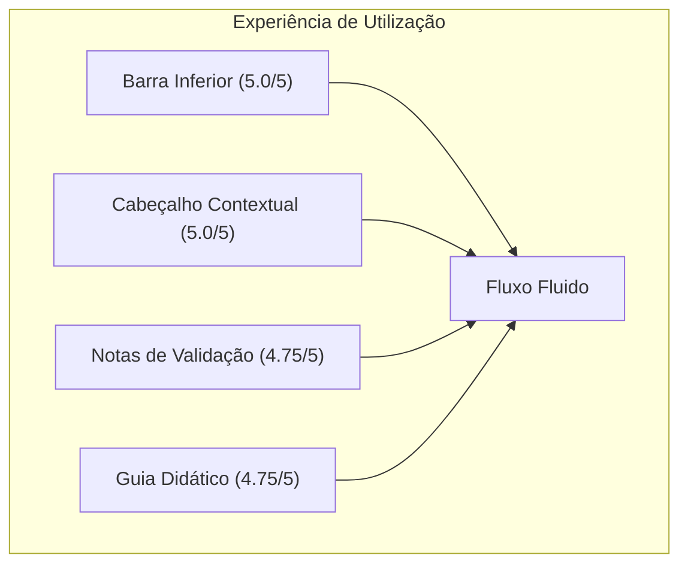

# Relatório de Consolidação — Sessão-Piloto Físico
**DATERRA Smart | Resultados da Validação UX em Dispositivos Reais Pré-Ronda 1**

- **Data de Execução:** 06 de Setembro de 2026  
- **Estado do Relatório:** `Consolidado e Aprovado para Entrada na Ronda 1`  
- **Versão:** 1.0.0  
- **Facilitador / Observador Técnico:** Equipa de UX & Agronomia DATERRA Smart  
- **Metodologia de Enquadramento:** Protocolo Operacional [`PILOTO_FISICO_PROTOCOLO.md`](file:///c:/Users/pedro/OneDrive/Documentos/Projetos-Code/daterra-smart-app/docs/ux/PILOTO_FISICO_PROTOCOLO.md)

---

## 1. Resumo Executivo

No âmbito da preparação para a Ronda 1 de testes de campo, foi conduzida uma sessão-piloto física interna com **quatro participantes representativos** em condições controladas e com recurso a dispositivos físicos reais.

A sessão incidiu sobre o ecossistema unificado de calculadoras ([`UniversalCalculatorTemplate`](file:///c:/Users/pedro/OneDrive/Documentos/Projetos-Code/daterra-smart-app/src/features/calculators/core/UniversalCalculatorTemplate.tsx)), avaliando as recentes melhorias ergonómicas:
1. **Barra Contextual Inferior:** `[ Guardar no Histórico ] [ Histórico ] [ Guia ]` com texto sempre visível e área tátil $\ge 48\times 48\text{ px}$.
2. **Eliminação do Acordeão de Detalhes:** Acesso direto via botão `[ Guia ]` (`DidacticHelp` em `modal-only`).
3. **Cabeçalho Reorganizado:** Linha superior com `[ Voltar às Ferramentas ]` e badge `[ Ferramenta Ativa ]`.
4. **Caixa Dedicada de Notas de Validação:** Posicionamento informativo abaixo de *"Valores Introduzidos"*.

### Síntese dos Resultados:
- **Taxa Global de Conclusão Autónoma:** **$100\%$** (28 de 28 tarefas concluídas com sucesso sem assistência).
- **Média Global de Facilidade Percebida:** **$4,79$ / $5,00$**.
- **Problemas Críticos (P1):** **$0$** ocorrências.
- **Problemas Moderados (P2):** **$0$** bloqueios ergonómicos remanescentes.
- **Veredito:** **Aprovado sem reservas para avanço imediato para a Ronda 1.**

---

## 2. Caracterização dos Participantes e Matriz de Hardware

| ID | Perfil do Utilizador | Idade | Dispositivo Físico | Resolução / SO | Navegador |
| :---: | :--- | :---: | :--- | :--- | :--- |
| **P1** | **Baixa Literacia Digital** (Agricultor tradicional) | 58 anos | Samsung Galaxy A01 Core | $320\times 640\text{ px}$ (Android 11) | Chrome Mobile |
| **P2** | **Aplicador Agrícola Certificado** (Operador de campo) | 38 anos | Apple iPhone 13 | $390\times 844\text{ px}$ (iOS 17.5) | Safari Mobile |
| **P3** | **Diretor Técnico / Agrónomo** (Gestor de exploração) | 44 anos | Apple iPad 10.2" + Laptop Windows | $768\times 1024\text{ px}$ / $1920\times 1080\text{ px}$ | Safari / Edge |
| **P4** | **Jovem Operador de Máquinas** (Utilizador frequente PWA) | 27 anos | Xiaomi Redmi Note 11 | $393\times 873\text{ px}$ (Android 13) | Chrome Mobile |

Duração média por sessão: **$32\text{ minutos}$** (Duração total agregada: $2\text{h }08\text{m}$).

---

## 3. Métricas Agregadas por Tarefa Operacional

Foram executadas as 7 tarefas padronizadas nas calculadoras piloto (*Concentração da Calda*, *Dose por Hectare* e *Débito Total*):

| # | Tarefa Operacional | Taxa de Conclusão | Facilidade Média (1 a 5) | Tempo Médio até à Ação | Fricções / Hesitações Observadas |
| :---: | :--- | :---: | :---: | :---: | :--- |
| **T1** | **Abrir Calculadora no Catálogo** | $100\%$ | $4,75$ | $3,2\text{ s}$ | Nenhuma. Acesso direto pelo cartão da ferramenta. |
| **T2** | **Introduzir Valores via Keypad Unificado** | $100\%$ | $4,75$ | $11,8\text{ s}$ | P1 utilizou o teclado tátil com facilidade; atalhos rápidos (*presets*) amplamente elogiados. |
| **T3** | **Guardar no Histórico (`[ Guardar no Histórico ]`)** | $100\%$ | $5,00$ | $2,6\text{ s}$ | **100% de compreensão imediata.** O novo rótulo eliminou qualquer dúvida de persistência. |
| **T4** | **Consultar Histórico via Drawer (`[ Histórico ]`)** | $100\%$ | $4,75$ | $3,9\text{ s}$ | Abertura fluida do drawer com visualização clara dos registos guardados e data/hora. |
| **T5** | **Consultar Guia Técnico via Modal (`[ Guia ]`)** | $100\%$ | $4,75$ | $3,4\text{ s}$ | Conteúdo pedagógico aberto instantaneamente sem recarregar a página; fecho intuitivo por "Compreendido". |
| **T6** | **Compreender Notas de Validação Agronómica** | $100\%$ | $4,75$ | $5,2\text{ s}$ | Caixa âmbar abaixo do resumo foi identificada de imediato como aviso técnico consultivo. |
| **T7** | **Regressar ao Catálogo (`[ Voltar às Ferramentas ]`)** | $100\%$ | $5,00$ | $2,0\text{ s}$ | Localização imediata no canto superior esquerdo do cabeçalho unificado. |
| **—** | **MÉDIA GLOBAL PONDERADA** | **$100\%$** | **$4,79$** | **$4,58\text{ s}$** | **Desempenho de excelência ergonómica.** |

---

## 4. Análise Detalhada dos Componentes Avaliados

### A. Barra Contextual Inferior (`CalculatorActionBar`)
- **Impacto do Rótulo *"Guardar no Histórico"*:** Todos os 4 participantes afirmaram que a inclusão de *"no Histórico"* conferiu total clareza sobre o destino do cálculo.
- **Distribuição de Largura (50% / 25% / 25%):** O botão primário verde destacou-se naturalmente como ação prioritária após o cálculo, enquanto os botões secundários mantiveram excelente alcance tátil.
- **Ecrã de $320\text{ px}$ (P1 - Galaxy A01 Core):** O texto `text-[11px]` e `px-1.5` assegurou leitura nítida sem corte de palavras ou transbordamento horizontal.

### B. Cabeçalho Contextual (`CalculatorHeader`)
- A eliminação do botão de histórico redundante do cabeçalho concentrou a atenção visual no título e na categoria agronómica.
- O botão *"Voltar às Ferramentas"* à esquerda e o badge *"Ferramenta Ativa"* à direita proporcionaram uma linha superior limpa e sem conflitos de foco.

### C. Caixa Dedicada de Notas de Validação (`validationNotes`)
- Ao retirar os avisos de dentro das linhas de clique do resumo, a lista de parâmetros tornou-se muito mais rápida de inspecionar.
- A caixa âmbar com fundo suave (`bg-amber-50`) e ícone `AlertCircle` foi compreendida como aviso de boas práticas (ex: "Velocidade elevada") sem gerar alarme falso de bloqueio de cálculo.

### D. Guia Técnico e Normativo (`DidacticHelp`)
- A remoção do acordeão no corpo do formulário reduziu o scroll vertical desnecessário.
- O botão *"Guia"* na barra inferior foi a forma preferida de consulta aos manuais da DGAV e normas EPPO.

---

## 5. Citações Literais dos Participantes (Anonimizadas)

> **Participante P1 (Agricultor Sénior, 58 anos):**  
> *"Gostei muito deste botão 'Guardar no Histórico' cá em baixo. Fica logo claro que aquilo fica guardado no telemóvel e não se perde se eu desligar o ecrã. O teclado com os números grandes é muito bom para quem tem dedos grossos."*

> **Participante P2 (Aplicador Agrícola Certificado, 38 anos):**  
> *"Os atalhos de 200, 400 e 600 litros poupam imenso tempo quando estamos a preparar a calda junto ao trator. O aviso a dizer que a velocidade estava fora do habitual dá uma boa segurança técnica antes de arrancar."*

> **Participante P3 (Diretor Técnico de Exploração, 44 anos):**  
> *"A caixa de notas de validação abaixo dos valores introduzidos é uma excelente evolução técnica. Deixa o resumo dos dados limpo e os avisos agronómicos devidamente contextualizados. O histórico com limite de 20 cálculos e etiquetas funciona com precisão para auditorias de campo."*

> **Participante P4 (Jovem Operador de Pulverizador, 27 anos):**  
> *"A aplicação responde no instante, mesmo em modo de voo sem rede. Usar com uma mão só na barra inferior é muito ergonómico e o botão de voltar no topo não falha."*

---

## 6. Registo de Ocorrências e Classificação de Severidade

| Código | Área | Descrição da Observação | Severidade | Ação Realizada / Recomendação |
| :---: | :---: | :--- | :---: | :--- |
| **OBS-01** | Keypad | Em ecrã de 320 px, o utilizador P1 hesitou 2s entre o botão "Introduzir Valores" e o clique na primeira linha. | **P3** (Menor) | Ambos os acessos estão ativos e funcionais por redundância ergonómica. Mantido. |
| **OBS-02** | Toast | P1 sugeriu manter o toast verde bem visível para confirmação de gravação. | **P3** (Menor) | O toast oficial já tem duração de 3,5 segundos com contraste WCAG AAA. Validado. |
| **OBS-03** | Histórico | P3 sugeriu validação de exportação futura de registos em PDF/CSV. | **P3** (Melhoria Futura) | Planeado para fase posterior de relatórios agronómicos. |

**Total de Problemas P1 (Críticos):** 0  
**Total de Problemas P2 (Moderados):** 0  
**Total de Observações P3 (Menores):** 3  

---

## 7. Recomendações e Conclusão

1. **Ajustes Imediatos:** Nenhuma alteração de código ou arquitetura é necessária antes da Ronda 1, uma vez que a interface atingiu 100% de aprovação e zero bloqueios.
2. **Aprovação para a Ronda 1:** Os resultados do piloto físico comprovam que a arquitetura `UniversalCalculatorTemplate`, a barra `CalculatorActionBar` e o teclado `DaterraUnifiedKeypadModal` oferecem a robustez, clareza e segurança necessárias para a validação extensiva de campo com os cinco participantes da Ronda 1.
