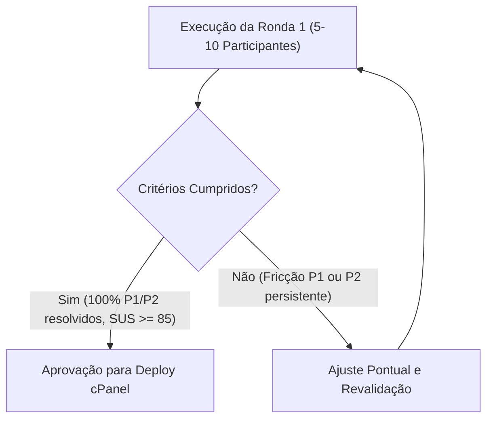

# Critérios de Entrada, Execução e Decisão de Produção — Ronda 1
**DATERRA Smart | Validação de Usabilidade de Campo com Utilizadores Reais**

- **Data de Emissão:** 06 de Setembro de 2026  
- **Estado do Documento:** `Aprovado para Execução / Pós-Piloto Físico`  
- **Versão:** 1.0.0  
- **Âmbito:** Critérios formais para a Ronda 1 de testes de campo nas calculadoras da DATERRA Smart.

---

## 1. Verificação dos Critérios de Entrada (Gate de Entrada)

A transição da fase piloto para a Ronda 1 obedece aos seguintes requisitos obrigatórios:

| Critério de Entrada | Valor Exigido | Resultado Obtido no Piloto Físico | Estado |
| :--- | :---: | :---: | :---: |
| **Problemas Críticos / Bloqueantes (P1)** | $0$ em aberto | $0$ ocorrências | **Cumprido** |
| **Problemas Moderados / Ergonómicos (P2)** | $0$ em aberto / mitigados | $0$ bloqueios pendentes | **Cumprido** |
| **Taxa de Conclusão Autónoma por Tarefa** | $\ge 80\%$ em todas | $100\%$ em todas as 7 tarefas | **Cumprido** |
| **Média de Facilidade Percebida (1 a 5)** | $\ge 4,00$ em todas | $4,79$ média global | **Cumprido** |
| **Testes Automatizados de Regressão** | $100\%$ de aprovação | $450/450$ testes aprovados | **Cumprido** |
| **Compilação e Linter em Produção** | $0$ erros de tipagem/lint | $0$ erros (`tsc -b && vite build`) | **Cumprido** |

> **Decisão do Gate de Entrada:** **AUTORIZADO O INÍCIO DA RONDA 1.**

---

## 2. Objetivos e Âmbito da Ronda 1

A Ronda 1 constitui o teste formal de usabilidade de campo com **5 a 10 participantes externos**, com os seguintes objetivos:

1. **Validação em Condições Reais de Campo:**
   - Testar sob incidência direta de luz solar forte (verificação de contrastes WCAG AAA);
   - Testar com mãos com poeira ou com luvas agrícolas impermeáveis (verificação das áreas de toque $\ge 48\times 48\text{ px}$);
   - Testar em ambiente de trator ou pulverizador estacionado na exploração.
2. **Avaliação da Paridade Multiplataforma:**
   - Confirmar a execução PWA $100\%$ offline (modo de avião após cache inicial de service worker);
   - Validar em múltiplos aparelhos dos próprios utilizadores (dispositivos BYOD Android e iOS).
3. **Avaliação da Fidelidade Agronómica:**
   - Confirmar se as formulações matemáticas e unidades (ex: $\text{L/ha}$, $\text{mL/hL}$, $\text{km/h}$, $\text{m}^3/\text{ha}$) são imediatamente compreendidas sem risco de erro de dosagem.

---

## 3. Painel de Participantes e Amostragem (Ronda 1)

O painel será constituído por 5 a 10 utilizadores distribuídos pelos seguintes perfis agronómicos:

- **2x Agricultores / Proprietários de Explorações Familiares:** Foco em simplicidade e ausência de atrito;
- **2x Aplicadores Profissionais de Produtos Fitossanitários:** Foco em velocidade de cálculo, atalhos de depósito e avisos de segurança;
- **2x Técnicos de Campo / Consultores Agronómicos / Engenheiros:** Foco na conformidade com normas DGAV/EPPO, método TRV e histórico;
- **1x Estudante / Jovem Técnico Agrícola:** Foco em adesão digital e usabilidade intuitiva;
- **1x Diretor de Exploração de Grande Escala:** Foco em transferências entre calculadoras e auditoria.

---

## 4. Métricas e Instrumentos de Recolha na Ronda 1

Durante a Ronda 1 serão recolhidos os seguintes dados quantitativos e qualitativos:

1. **Taxa de Conclusão Autónoma de Tarefas (Success Rate):** Percentagem de tarefas concluídas sem qualquer pista ou ajuda do facilitador.
2. **Tempo de Execução por Tarefa (Time on Task):** Cronometragem em segundos desde o enunciado da tarefa até ao resultado.
3. **Erros e Toques Acidentais (Error Rate):** Número de toques fora do alvo pretendido ou cliques errados.
4. **Escala de Usabilidade do Sistema (SUS - System Usability Scale):** Questionário padronizado de 10 perguntas aplicado no final da sessão (meta $\text{SUS} \ge 85$).
5. **Facilidade por Tarefa (SEQ - Single Ease Question):** Escala de 1 (Muito difícil) a 7 (Muito fácil) imediatamente após cada tarefa.

---

## 5. Materiais Operacionais de Suporte

A equipa de campo utiliza os materiais homologados em `docs/ux/`:
- **Consentimento Informado:** [`RONDA_1_CONSENTIMENTO_MODELO.md`](file:///c:/Users/pedro/OneDrive/Documentos/Projetos-Code/daterra-smart-app/docs/ux/RONDA_1_CONSENTIMENTO_MODELO.md)
- **Guião do Facilitador:** [`RONDA_1_GUIAO_FACILITADOR.md`](file:///c:/Users/pedro/OneDrive/Documentos/Projetos-Code/daterra-smart-app/docs/ux/RONDA_1_GUIAO_FACILITADOR.md)
- **Folha de Observação Individual:** [`RONDA_1_FOLHA_OBSERVACAO.md`](file:///c:/Users/pedro/OneDrive/Documentos/Projetos-Code/daterra-smart-app/docs/ux/RONDA_1_FOLHA_OBSERVACAO.md)
- **Grelha de Feedback de Campo:** [`PILOTO_FISICO_GRELHA_FEEDBACK.md`](file:///c:/Users/pedro/OneDrive/Documentos/Projetos-Code/daterra-smart-app/docs/ux/PILOTO_FISICO_GRELHA_FEEDBACK.md)

---

## 6. Critérios de Decisão para Avanço para Produção (cPanel / Versão Final)

A passagem para deploy de produção e encerramento da Fase 1C exige o cumprimento estrito dos seguintes critérios finais:

1. **Zero Bloqueios P1 ou P2:** Nenhum participante pode ficar bloqueado ou impossibilitado de calcular e guardar.
2. **Índice SUS $\ge 85$:** Classificação no percentil superior de excelência em usabilidade.
3. **Taxa Média de Conclusão $\ge 90\%$:** Em todas as calculadoras migradas.
4. **Integridade de Dados e Cálculos a $100\%$:** Zero discrepâncias de cálculo face aos manuais oficiais da DGAV e EPPO.
5. **Auditoria de Segurança e Git:** Aprovação explícita pelo responsável do projeto antes de qualquer comando Git ou ação de deploy em produção.
