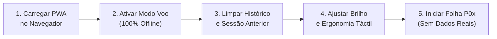

# Guião do Facilitador — Ronda 1 de Testes de Usabilidade
**DATERRA Smart** | Protocolo Operacional de Condução e Moderação de Teste Formativo

- **Data de Criação:** 06 de Setembro de 2026  
- **Estado do Documento:** `Guião Operacional Aprovado para a Ronda 1`  
- **Versão:** 1.0.0  
- **Âmbito:** Condução presencial de sessões individuais de 25 a 35 minutos com os participantes `P01` a `P05`.

---

## 1. Objetivo da Ronda 1

A Ronda 1 é um teste formativo concebido para:
1. Identificar bloqueios ergonómicos e dificuldades de navegação de severidade **Crítica (P1)** ou **Alta (P2)**.
2. Avaliar a clareza imediata do resultado principal e das submétricas.
3. Observar a usabilidade do `DaterraUnifiedKeypadModal` e da ação *"Editar Tudo"*.
4. Verificar a compreensão das unidades de medida e dos alertas agronómicos não bloqueantes.
5. Avaliar o comportamento do ecossistema em dispositivos móveis e em modo $100\%$ offline.
6. Analisar a acessibilidade e utilidade do microlearning (`DidacticHelp`).

---

## 2. Preparação Técnica e do Dispositivo

Antes de receber cada participante, o facilitador deve assegurar os seguintes passos:



1. **Garantia de Cache Offline:** Abrir previamente a aplicação no dispositivo de teste com ligação à rede para assegurar que todos os recursos e dados estão precacheados pelo Service Worker.
2. **Ativação de Modo Offline:** Colocar o dispositivo em modo de voo (sem Wi-Fi nem dados móveis) antes de iniciar a sessão.
3. **Limpeza de Estado:** Garantir que os formulários das calculadoras estão no estado inicial predefinido e que não existem transferências pendentes de sessões anteriores.
4. **Condições do Ecrã:** Ajustar o brilho para o nível máximo caso o teste decorra no exterior sob luz solar intensa.
5. **Dados Fictícios:** Utilizar exclusivamente os valores padronizados deste guião; nunca introduzir nomes de explorações reais, parcelas ou credenciais.

---

## 3. Estrutura Temporal da Sessão (25 a 35 Minutos)

| Bloco Temporal | Duração | Atividade Principal |
|---|---|---|
| **Bloco 1: Boas-vindas e Enquadramento** | $3\text{ minutos}$ | Explicação do teste, consentimento informado e desmistificação. |
| **Bloco 2: Execução das 3 Tarefas** | $15\text{ a }20\text{ minutos}$ | Realização das tarefas atribuídas pelo participante em regime de *Think Aloud*. |
| **Bloco 3: Questionário de Satisfação** | $5\text{ minutos}$ | Resposta oral ou escrita às 6 perguntas padronizadas (escala 1 a 5). |
| **Bloco 4: Comentários e Encerramento** | $3\text{ a }5\text{ minutos}$ | Registo de impressões livres, agradecimento e encerramento. |

---

## 4. Roteiro Verbal Sugerido para o Facilitador

O facilitador deve ler ou transmitir os seguintes pontos no início da sessão:

> *"Muito obrigado pela sua disponibilidade para participar nesta sessão da DATERRA Smart.*  
> 
> *Gostaria de sublinhar três pontos muito importantes:*  
> *1. **Estamos a testar a aplicação, não a sua competência.** Não existem respostas certas ou erradas da sua parte. Qualquer dificuldade que sinta é uma falha no design da aplicação que precisamos de corrigir.*  
> *2. **Gostaríamos que pensasse em voz alta.** Vá dizendo o que está a ver, o que procura no ecrã e o que espera que aconteça quando clica num botão.*  
> *3. **A participação é totalmente voluntária.** Se a qualquer momento desejar fazer uma pausa ou interromper o teste, basta dizer-me.*  
> 
> *Durante as tarefas, eu vou estar em silêncio a tomar notas para não influenciar o teste. Não estranhe se eu não responder logo a perguntas sobre onde clicar; o meu objetivo é ver se a aplicação é intuitiva por si própria.*  
> 
> *Podemos começar?"*

---

## 5. Matriz de Distribuição de Tarefas (Máximo 3 por Participante)

Para evitar fadiga cognitiva, cada participante realiza estritamente **3 tarefas**:

```text
Distribuição Oficial:
- Participante P01:
  Tarefa A: Concentração da Calda (calc_concentracao)
  Tarefa B: Velocidade Real (calc_velocidade_real)
  Tarefa C: Débito Total (calc_debito_total)

- Participante P02:
  Tarefa A: Dose por Hectare (calc_dose)
  Tarefa B: Área de Parede Foliar LWA (calc_area_parede_foliar)
  Tarefa C: Volume de Copa TRV (calc_volume_copa)

- Participante P03:
  Tarefa A: Concentração da Calda (calc_concentracao)
  Tarefa B: Volume de Calda por TRV (calc_volume_calda_trv)
  Tarefa C: Débito Total (calc_debito_total)

- Participante P04:
  Tarefa A: Dose por Hectare (calc_dose)
  Tarefa B: Velocidade Real (calc_velocidade_real)
  Tarefa C: Volume de Copa TRV (calc_volume_copa)

- Participante P05:
  Tarefa A: Área de Parede Foliar LWA (calc_area_parede_foliar)
  Tarefa B: Volume de Copa TRV (calc_volume_copa)
  Tarefa C: Volume de Calda por TRV (calc_volume_calda_trv)
```

---

## 6. Guião Detalhado das Tarefas com Gabarito Matemático Homologado

### Tarefa 1 — Concentração da Calda: Produto Líquido (`calc_concentracao`)
- **Instrução ao Participante:**  
  *"Abra a Calculadora de Concentração. No modo de Planta Jovem, pretende preparar um depósito de 400 L com uma concentração recomendada de 100 mL/hL. Calcule a quantidade de produto comercial necessária."*
- **Entradas a Introduzir:** Modo = `jovem` (Planta Jovem) · Volume = $400\text{ L}$ · Concentração = $100\text{ mL/hL}$.
- **Resultado Esperado:** Principal: $\mathbf{400\text{ mL}}$ ou $\mathbf{0{,}40\text{ L}}$ · Auxiliar correspondente.
- **Focos de Observação:**
  - O participante encontra o botão de edição ou utiliza *"Editar Tudo"*?
  - Compreende a unidade $\text{mL/hL}$ sem hesitação?
  - Confirma o resultado no cabeçalho fixo superior?

---

### Tarefa 2 — Dose por Hectare: Produto Líquido (`calc_dose`)
- **Instrução ao Participante:**  
  *"Abra a Calculadora de Dose. Para um depósito de 1200 L, uma dose de 2,0 L/ha e um volume de calda de 400 L/ha, calcule a quantidade de produto e a área tratada."*
- **Entradas a Introduzir:** Volume Depósito = $1200\text{ L}$ · Dose = $2{,}0\text{ L/ha}$ · Volume Calda = $400\text{ L/ha}$.
- **Resultado Esperado:** Quantidade de Produto = $\mathbf{6{,}00\text{ L}}$ · Área Tratada por Depósito = $\mathbf{3{,}0\text{ ha}}$.
- **Focos de Observação:**
  - Identifica a área tratada nos resultados secundários?
  - Compreende que os valores se referem a um depósito completo?

---

### Tarefa 3 — Velocidade Real de Trabalho (`calc_velocidade_real`)
- **Instrução ao Participante:**  
  *"Abra a Calculadora de Velocidade. Cronometrou a passagem do pulverizador num troço de 100 metros no terreno, tendo demorado 56 segundos. Calcule a velocidade de trabalho."*
- **Entradas a Introduzir:** Distância = $100\text{ m}$ · Tempo = $56\text{ s}$.
- **Resultado Esperado:** Principal: $\mathbf{6{,}4\text{ km/h}}$ · Auxiliar: $\mathbf{1{,}8\text{ m/s}}$.
- **Focos de Observação:**
  - Tenta introduzir decimais ou usa os presets?
  - Compreende a relação entre $\text{km/h}$ e $\text{m/s}$?

---

### Tarefa 4 — Área de Parede Foliar LWA (`calc_area_parede_foliar`)
- **Instrução ao Participante:**  
  *"Abra a Calculadora de Área de Parede Foliar. Num pomar com altura de sebe tratada de 2,5 metros e distância entrelinhas de 3,0 metros, calcule a área de parede foliar por hectare."*
- **Entradas a Introduzir:** Altura = $2{,}5\text{ m}$ · Entrelinha = $3{,}0\text{ m}$.
- **Resultado Esperado:** $\mathbf{16.667\text{ m}^2\text{ LWA/ha}}$ (formato inteiro com separador de milhar).
- **Focos de Observação:**
  - Procura o botão de ajuda para esclarecer a definição de altura de sebe?
  - Lê o resultado com facilidade?

---

### Tarefa 5 — Volume de Copa TRV (`calc_volume_copa`)
- **Instrução ao Participante:**  
  *"Abra a Calculadora de Volume de Copa. Introduza altura de 2,5 m, largura de copa de 1,0 m e entrelinha de 3,0 m. Calcule o TRV e transfira o valor para a calculadora de volume de calda."*
- **Entradas a Introduzir:** Altura = $2{,}5\text{ m}$ · Largura = $1{,}0\text{ m}$ · Entrelinha = $3{,}0\text{ m}$.
- **Resultado Esperado:** $\mathbf{8.333{,}3\text{ m}^3\text{ TRV/ha}}$.
- **Ação Complementar:** Clica em *"Transferir para Volume de Calda por TRV"* e navega para a ferramenta seguinte.
- **Focos de Observação:**
  - Percebe o botão de transferência inter-ferramentas?
  - Reconhece a mensagem de TRV importado no destino?

---

### Tarefa 6 — Volume de Calda por TRV (`calc_volume_calda_trv`)
- **Instrução ao Participante:**  
  *"Com o TRV de 8.333,3 m³/ha, selecione o perfil orientador 'Pomar' e o patamar de copa 'Densa' (k = 0,050 L/m³). Verifique o volume de calda. Depois, altere manualmente o valor de k para 0,055 L/m³."*
- **Entradas a Introduzir:** TRV = $8.333{,}3\text{ m}^3/\text{ha}$ · Perfil = *Pomar mediterrânico* · Patamar = *Densa* ($k = 0{,}050$).
- **Resultado Esperado (1):** $Q = \mathbf{416{,}7\text{ L/ha}}$.
- **Ação de Edição Manual:** Introduzir $k = 0{,}055\text{ L/m}^3$.
- **Resultado Esperado (2):** $Q = \mathbf{458{,}3\text{ L/ha}}$ com indicação visual de *"Valor manual"*.
- **Focos de Observação:**
  - Compreende que os patamares são orientadores e não obrigatórios?
  - Percebe a transição automática para *"Valor manual"* ao digitar no campo?
  - Entende a mensagem de aviso não bloqueante?

---

### Tarefa 7 — Débito Total do Pulverizador (`calc_debito_total`)
- **Instrução ao Participante:**  
  *"Abra a Calculadora de Débito Total. Selecione o critério 'Distância Entrelinhas'. Introduza volume de 600 L/ha, velocidade de 6,0 km/h e largura de 4,0 m. Calcule o débito da máquina. Em seguida, ative o cálculo por bico para 20 bicos ativos em simultâneo."*
- **Entradas a Introduzir:** Critério = `row_spacing` · Volume = $600\text{ L/ha}$ · Velocidade = $6{,}0\text{ km/h}$ · Largura = $4{,}0\text{ m}$.
- **Resultado Esperado (1):** Débito Total = $\mathbf{24{,}0\text{ L/min}}$.
- **Ação Complementar:** Clicar em *"+ Calcular débito por bico (opcional)"* e introduzir $N = 20$.
- **Resultado Esperado (2):** Débito Médio por Bico = $\mathbf{1{,}20\text{ L/min por bico}}$.
- **Focos de Observação:**
  - Seleciona facilmente o critério de largura nos 3 botões visíveis?
  - Compreende a expressão *"bicos ativos em simultâneo"*?
  - Repara na nota contextual de distribuição vertical?

---

## 7. Regras de Observação Estrita para o Facilitador

1. **Neutralidade Absoluta:** Nunca apontar com o dedo para o ecrã nem indicar onde estão os botões.
2. **Silêncio Construtivo:** Se o participante hesitar, aguardar pelo menos $5\text{ a }10\text{ segundos}$ antes de intervir.
3. **Registo de Incidentes:** Registar na folha de observação:
   - Hesitações $\ge 3\text{ segundos}$.
   - Tentativas frustradas de clicar em campos não editáveis.
   - Tentativas de acionar o teclado nativo do sistema operativo.
   - Dificuldades de leitura sob luz solar.
   - Dúvidas expressas sobre conceitos agronómicos (TRV, LWA, $k$, modo de planta).
4. **Sem Ensino da Solução:** Se o participante perguntar *"É aqui que clico?"*, responder de forma neutra: *"Onde é que lhe parece mais natural clicar?"*.

---

## 8. Critérios de Paragem Imediata da Tarefa

A tarefa deve ser interrompida pelo facilitador nas seguintes situações:
1. **Pedido do Participante:** Se expressar desconforto ou pedir para parar.
2. **Bloqueio Persistente:** Se ultrapassar $3\text{ minutos}$ sem conseguir avançar numa única etapa.
3. **Risco de Fricção Excessiva:** Se demonstrar frustração acentuada.
4. **Notificação Pessoal no Dispositivo:** Se surgir uma notificação privada no ecrã (pausar e ocultar imediatamente).

---

## 9. Próximos Passos Pós-Sessão

Após a conclusão das 5 sessões da Ronda 1:
1. Recolher as 5 folhas de observação (`P01` a `P05`).
2. Consolidar as métricas na matriz de severidade (P1 a P4).
3. Conduzir a reunião de triagem técnica da Fase 1C.4 para decidir as correções obrigatórias antes da Ronda 2.
