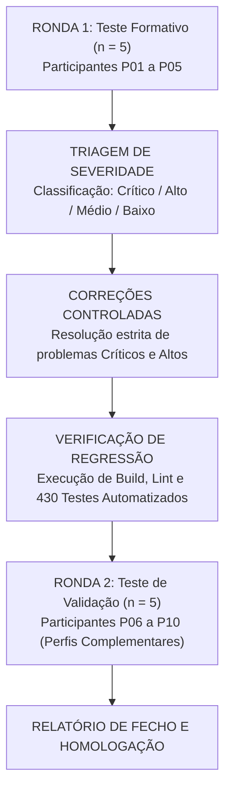

# Protocolo Operacional de Testes de Usabilidade de Campo
**DATERRA Smart** | Metodologia Iterativa de Avaliação Ergonómica e Validação no Terreno

- **Data de Criação:** 06 de Setembro de 2026  
- **Estado do Documento:** `Protocolo Operacional Aprovado para Execução na Fase 1C`  
- **Versão:** 1.0.0  
- **Âmbito:** Condução das sessões de teste com agricultores, técnicos e aplicadores para validação das 7 ferramentas das Fases 1A e 1B.

---

## 1. Objetivo dos Testes

O objetivo deste protocolo é avaliar a eficácia, eficiência e satisfação dos utilizadores da plataforma DATERRA Smart em condições agrícolas reais (exterior, luz solar direta, utilização com luvas e em modo $100\%$ offline).

As sessões visam identificar precocemente bloqueios de interface, ambiguidades na nomenclatura e pontos de atrito antes do alargamento a novas ferramentas e suites normativas.

---

## 2. Âmbito das Ferramentas Avaliadas

O teste cobre a totalidade das **7 calculadoras oficiais** homologadas nas Fases 1A e 1B:

| Ferramenta | Identificador Técnico | Categoria | Finalidade Principal |
|---|---|---|---|
| **Concentração da Calda** | `calc_concentracao` | PULVERIZAÇÃO | Cálculo da quantidade de produto fitofarmacêutico por depósito. |
| **Dose por Hectare** | `calc_dose` | PULVERIZAÇÃO | Cálculo da quantidade de produto e autonomia de área por depósito. |
| **Velocidade Real** | `calc_velocidade_real` | CALIBRAÇÃO | Determinação da velocidade de trabalho em $\text{km/h}$ e $\text{m/s}$. |
| **Área de Parede Foliar** | `calc_area_parede_foliar` | GEOMETRIA DA COPA | Cálculo da área de sebe foliar ($\text{m}^2\text{ LWA/ha}$). |
| **Volume de Copa** | `calc_volume_copa` | GEOMETRIA DA COPA | Estimativa do volume tridimensional de copa ($\text{m}^3\text{ TRV/ha}$). |
| **Volume de Calda TRV** | `calc_volume_calda_trv` | VOLUME DE CALDA | Determinação do volume de calda ($\text{L/ha}$) com base no TRV e $k$. |
| **Débito Total** | `calc_debito_total` | CALIBRAÇÃO | Cálculo do débito do pulverizador ($\text{L/min}$) e débito médio por bico. |

---

## 3. Metodologia Iterativa em Duas Rondas

O processo segue uma abordagem formativa/somativa dividida em duas fases consecutivas:



1. **Ronda 1 — Formativa ($n = 5$ participantes):** Foco na descoberta de dificuldades de introdução de dados, legibilidade e interpretação de unidades.
2. **Triagem e Resolução:** Correção prioritária de falhas classificadas como *Críticas* ou *Altas*. Qualquer alteração de código exige passagem limpa nos 430 testes automatizados existentes. Fórmulas matemáticas não são alteradas sem autorização formal.
3. **Ronda 2 — Validação ($n = 5$ participantes adicionais):** Repetição das tarefas principais com novos participantes para validar a eficácia das correções e assegurar a ausência de novas regressões.

---

## 4. Perfis dos Participantes e Recrutamento

Para cobrir a diversidade de contextos de campo, os 10 participantes são distribuídos por 3 perfis prioritários:

1. **Perfil A — Agricultor / Aplicador com Experiência Prática ($4$ participantes):**
   - Utilizador diário de atomizadores ou barras de pulverização.
   - Foco da observação: rapidez de cálculo, operação com uma só mão e legibilidade sob luz solar intensa.
2. **Perfil B — Técnico Agrícola / Consultor de Campo ($3$ participantes):**
   - Responsável pelo aconselhamento fitossanitário e calibração de máquinas.
   - Foco da observação: coerência das unidades, interpretação de TRV/LWA e notas técnicas de distribuição vertical.
3. **Perfil C — Utilizador com Baixa Literacia Digital ($3$ participantes):**
   - Profissional com pouca familiaridade com smartphones ou aplicações avançadas.
   - Foco da observação: intuitividade do teclado numérico, facilidade do botão *"Editar Tudo"* e clareza das mensagens de erro.

---

## 5. Protocolo de Consentimento e Minimização de Dados (RGPD)

O protocolo segue o princípio da minimização estrita de dados:
- **Anonimização Integral:** Os participantes são identificados exclusivamente por códigos alfanuméricos (`P01` a `P10`).
- **Não Recolha de Dados Sensíveis:** Não são recolhidos nomes, contactos, NIF, moradas ou coordenadas GPS das explorações.
- **Consentimento Informado:** Cada participante assina (ou valida verbalmente de forma registada) a autorização voluntária de participação, com direito explícito de interromper a sessão a qualquer momento.
- **Gravação de Ecrã:** Puramente facultativa, restrita à interface da aplicação e destruída após a elaboração do relatório final da Fase 1C.
- **Acesso Restrito:** Os formulários brutos são conservados exclusivamente pela equipa técnica responsável durante a Fase 1C.

---

## 6. Condições Operacionais de Campo

| Condição | Cenário de Teste | Aspeto a Avaliar |
|---|---|---|
| **Dispositivos** | Android (gama média), iPhone (iOS Safari), Tablet (10"), Desktop. | Responsividade, áreas de toque e ausência de scroll horizontal. |
| **Luminosidade** | Interior (escritório) e Exterior (luz solar direta). | Rácio de contraste do tema verde institucional (`#114037`) e legibilidade dos textos brancos e de aviso. |
| **Conectividade** | Modo de Voo ($100\%$ offline). | Funcionamento sem rede, carregamento estático do microlearning e gravação local no IndexedDB. |
| **Ergonomia Física** | Operação com uma mão e com luvas agrícolas impermeáveis. | Precisão dos alvos táteis $\ge 48\times 48\text{ px}$ e estabilidade do keypad. |

---

## 7. Distribuição Equilibrada de Tarefas (Máximo 3 por Participante)

Para prevenir a fadiga cognitiva e garantir dados de alta qualidade, cada participante realiza no máximo **3 tarefas**, cobrindo áreas complementares:

```text
Distribuição dos Grupos de Teste:
- Grupo 1 (P01, P04, P07, P10):
  Tarefa 1: Concentração (calc_concentracao)
  Tarefa 2: Velocidade Real (calc_velocidade_real)
  Tarefa 3: Volume de Calda por TRV (calc_volume_calda_trv)

- Grupo 2 (P02, P05, P08):
  Tarefa 1: Dose por Hectare (calc_dose)
  Tarefa 2: Área de Parede Foliar (calc_area_parede_foliar)
  Tarefa 3: Débito Total (calc_debito_total)

- Grupo 3 (P03, P06, P09):
  Tarefa 1: Volume de Copa (calc_volume_copa) com transferência
  Tarefa 2: Volume de Calda por TRV (calc_volume_calda_trv)
  Tarefa 3: Débito Total (calc_debito_total)
```

---

## 8. Cenários de Teste e Gabarito Matemático Homologado

Todos os cenários utilizam valores e resultados estritamente confirmados pelos testes unitários existentes:

### Cenário 1: Velocidade Real de Trabalho (`calc_velocidade_real`)
- **Instrução ao Participante:** *"O trator percorreu 100 metros no terreno em 56 segundos. Calcule a velocidade de trabalho."*
- **Entradas:** Distância = $100\text{ m}$; Tempo = $56\text{ s}$.
- **Gabarito Esperado:** Velocidade = $\mathbf{6{,}4\text{ km/h}}$ (auxiliar: $\mathbf{1{,}8\text{ m/s}}$).

### Cenário 2: Área de Parede Foliar (`calc_area_parede_foliar`)
- **Instrução ao Participante:** *"Num pomar com altura de sebe de 2,5 metros e entrelinha de 3,0 metros, calcule a área foliar por hectare."*
- **Entradas:** Altura = $2{,}5\text{ m}$; Entrelinha = $3{,}0\text{ m}$.
- **Gabarito Esperado:** LWA = $\mathbf{16.667\text{ m}^2\text{ LWA/ha}}$ (número inteiro).

### Cenário 3: Volume de Copa TRV (`calc_volume_copa`)
- **Instrução ao Participante:** *"Num pomar com altura de 2,5 m, largura de copa de 1,0 m e entrelinha de 3,0 m, calcule o volume de copa e transfira para a calda."*
- **Entradas:** Altura = $2{,}5\text{ m}$; Largura = $1{,}0\text{ m}$; Entrelinha = $3{,}0\text{ m}$.
- **Gabarito Esperado:** TRV = $\mathbf{8.333{,}3\text{ m}^3\text{ TRV/ha}}$.

### Cenário 4: Volume de Calda por TRV (`calc_volume_calda_trv`)
- **Instrução ao Participante:** *"Com o TRV de 8.333,3 m³/ha, selecione o perfil Pomar e o patamar de copa Densa (k = 0,050 L/m³). Calcule o volume de calda."*
- **Entradas:** TRV = $8.333{,}3\text{ m}^3/\text{ha}$; $k = 0{,}050\text{ L/m}^3$.
- **Gabarito Esperado:** Volume de Calda = $\mathbf{416{,}7\text{ L/ha}}$.

### Cenário 5: Débito Total do Pulverizador (`calc_debito_total`)
- **Instrução ao Participante:** *"Com volume de 600 L/ha, entrelinha de 4,0 m, velocidade de 6,0 km/h e 20 bicos ativos em simultâneo, calcule o débito total e o débito médio por bico."*
- **Entradas:** Volume = $600\text{ L/ha}$; Largura = $4{,}0\text{ m}$ (critério *Distância Entrelinhas*); Velocidade = $6{,}0\text{ km/h}$; Bicos = $20$.
- **Gabarito Esperado:** Débito Total = $\mathbf{24{,}0\text{ L/min}}$; Débito por Bico = $\mathbf{1{,}20\text{ L/min por bico}}$.

### Cenário 6: Concentração da Calda (`calc_concentracao`)
- **Instrução ao Participante:** *"Para um depósito de 1000 L em Planta Jovem, calcule a quantidade de produto comercial para uma concentração recomendada de 0,15% (líquido) ou 150 g/hL (sólido)."*
- **Gabarito Esperado:** Produto Líquido ($0{,}15\%$) = $\mathbf{1{,}50\text{ L}}$ ($1500\text{ mL}$); Produto Sólido ($150\text{ g/hL}$) = $\mathbf{1{,}50\text{ kg}}$ ($1500\text{ g}$).

### Cenário 7: Dose por Hectare (`calc_dose`)
- **Instrução ao Participante:** *"Para um depósito de 1200 L, volume de calda de 400 L/ha e dose de 2,0 L/ha, calcule a quantidade de produto e a área coberta."*
- **Gabarito Esperado:** Produto = $\mathbf{6{,}00\text{ L}}$; Área Tratada = $\mathbf{3{,}0\text{ ha}}$.

---

## 9. Grelha Padronizada de Observação Técnica

Durante cada tarefa, o facilitador regista os seguintes parâmetros:

| Parâmetro de Medição | Descrição Operacional | Métrica |
|---|---|---|
| **Tempo até ao Primeiro Resultado (TTR)** | Cronómetro desde o primeiro toque no ecrã até à visualização do resultado correto. | Segundos |
| **Conclusão da Tarefa** | Conclusão autónoma com sucesso vs necessidade de apoio. | Sucesso / Com Apoio / Falha |
| **Erros de Digitação** | Número de toques no botão de apagar (`Delete`) ou valores corrigidos. | Contagem |
| **Toques Totais** | Quantidade total de interações tácteis até concluir o cálculo. | Contagem |
| **Uso do Teclado Unificado** | Fluidez no uso do `DaterraUnifiedKeypadModal` e compreensão do botão "Concluir". | Escala qualitativa |
| **Uso da Ação "Editar Tudo"** | Compreensão do fluxo sequencial entre campos dentro do modal. | Observação |
| **Consulta de Microlearning** | Recurso ao botão de ajuda para esclarecer dúvidas sobre os campos. | Sim / Não |
| **Hesitações e Dificuldades** | Dificuldade com unidades, confusão de campos ou hesitação em botões. | Registo de incidentes |

---

## 10. Matriz de Classificação de Severidade

Os problemas identificados são classificados segundo a escala padronizada:

| Nível de Severidade | Definição Operacional | Critério de Decisão na Fase 1C |
|---|---|---|
| **Crítico (P1)** | Bloqueia a conclusão da tarefa, provoca crash, bloqueia o teclado ou impede a leitura do resultado. | **Correção Imediata e Obrigatória** antes da Ronda 2. |
| **Alto (P2)** | Provoca hesitação grave, induz o utilizador a introduzir uma unidade errada ou oculta informação essencial. | **Correção Obrigatória** antes da Ronda 2. |
| **Médio (P3)** | Causa lentidão ou confusão momentânea, mas o utilizador consegue corrigir autonomamente. | Documentado para resolução na Fase 1C.6 ou Fase 2. |
| **Baixo (P4)** | Sugestão estética, microajuste de espaçamento ou preferência pessoal sem impacto operacional. | Registado no backlog geral. |

---

## 11. Questionário Pós-Sessão de Satisfação (Escala 1 a 5)

Após a conclusão das 3 tarefas, o participante responde às seguintes 6 perguntas:

1. *"Foi fácil e rápido introduzir os números no teclado do ecrã?"*  
   `(1 = Muito difícil · 2 = Difícil · 3 = Neutro · 4 = Fácil · 5 = Muito fácil)`
2. *"Os resultados e as unidades foram claros e fáceis de ler ao ar livre?"*  
   `(1 = Muito confuso · 2 = Pouco claro · 3 = Aceitável · 4 = Claro · 5 = Muito claro)`
3. *"O botão 'Editar Tudo' e o resumo de valores ajudaram a verificar os dados antes de aplicar?"*  
   `(1 = Nada útil · 2 = Pouco útil · 3 = Útil · 4 = Muito útil · 5 = Indispensável)`
4. *"Sentiu confiança de que os cálculos estavam corretos para usar no pulverizador?"*  
   `(1 = Nenhuma confiança · 2 = Pouca · 3 = Confiança moderada · 4 = Elevada · 5 = Confiança total)`
5. *"A aplicação funcionou perfeitamente sem ligação à internet?"*  
   `(1 = Não funcionou · 2 = Com falhas · 3 = Razoável · 4 = Bom · 5 = Perfeito)`
6. *"Foi fácil corrigir um valor quando se enganou a digitar?"*  
   `(1 = Muito difícil · 2 = Difícil · 3 = Normal · 4 = Fácil · 5 = Muito fácil)`

---

## 12. Processo de Triagem e Relatório de Validação

1. **Consolidação dos Dados da Ronda 1:** Agrupamento de todas as fichas de observação e cálculo das médias da escala 1 a 5.
2. **Reunião de Triagem Técnica:** Análise dos incidentes P1 e P2.
3. **Execução de Ajustes:** Aplicação estrita das melhorias nos ficheiros de UI/UX autorizados.
4. **Bateria de Testes de Regressão:** Execução de `npm run build`, `npm run lint` e `node --test test/*.test.mjs`.
5. **Execução da Ronda 2:** Validação com os participantes `P06` a `P10`.
6. **Emissão do Relatório de Fecho:** Síntese final com aprovação das ferramentas para uso produtivo.
